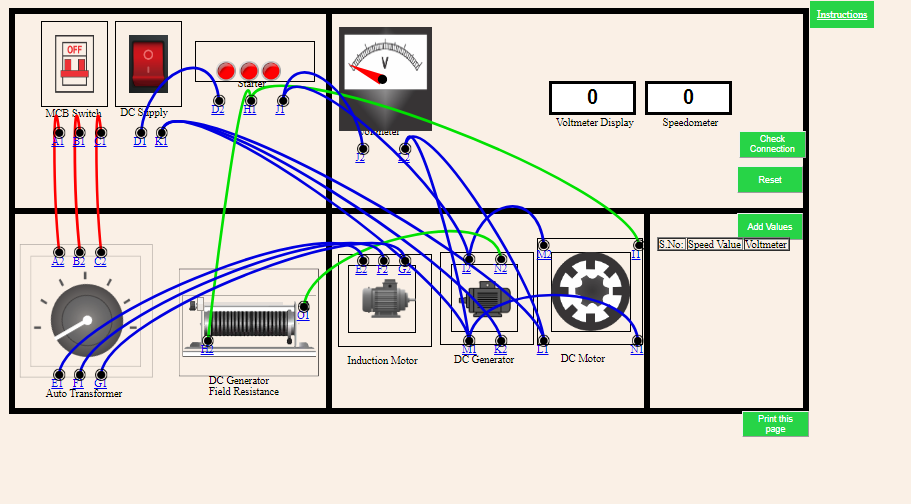
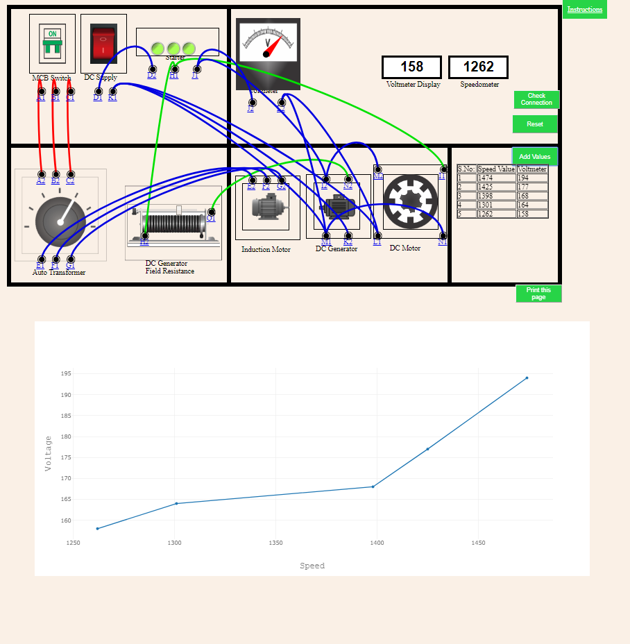

<b>Step 1</b>
                      
In the circuit shown below are placed all the components, i.e. 
MCB Switch, DC Supply, Starter, Voltmeter, RPM Meter, Auto-transformer, DC Generator Field Resistance, Induction Motor, DC Generator, DC Motor. 

Make the connections by connecting the dots as follows: 
1. Connect points A1, B1, C1 of MCB Switch to input points A2, B2, C2 of Auto-transformer respectively. 
2. Connect output points E1, F1, G1 of Auto-transformer to points E2, F2, G2 of Induction Motor respectively. 
3. Connect point D1 of DC Supply with point D2 of Starter. 
   Connect point K1 of DC Supply with points M1, K2 of DC Generator,and point L1 of DC Motor. 
4.  Connect point H1 of Starter with point H2 of DC Generator Field Resistance and I1 of DC Motor. 
Connect point J1 of Starter with point J2 of Voltmeter and with point I2 of DC Generator. 
5.  Connect point I2 of DC generator with point M2 of DC motor. 
Connect point M1 of DC generator with point N1 of DC motor. 
Connect point N2 of DC generator with point O1 of DC Generator Field Resistance. 
6.  Connect point L1 of DC Motor with point L2 of Voltmeter. 
Connect point L2 of Voltmeter with point M1 of DC generator. 
 
  If the wire is misplaced, click the node number to deattach the nodes' wire. </b>  
   

        <table>
            <tr>
                <th>From</th>
                <th>To</th>
            </tr>
            <tr>
                <td>A1</td>
                <td>A2</td>
            </tr>
            <tr>
                <td>B1</td>
                <td>B2</td>
            </tr>
            <tr>
                <td>C1</td>
                <td>C2</td>
            </tr>
            <tr>
                <td>D1</td>
                <td>D2</td>
            </tr>
            <tr>
                <td>E1</td>
                <td>E2</td>
            </tr>
            <tr>
                <td>F1</td>
                <td>F2</td>
            </tr>
            <tr>
                <td>G1</td>
                <td>G2</td>
            </tr>
            <tr>
                <td>H1</td>
                <td>H2</td>
            </tr>
            <tr>
                <td>H1</td>
                <td>I1</td>
            </tr>
            <tr>
                <td>J1</td>
                <td>J2</td>
            </tr>
            <tr>
                <td>J1</td>
                <td>I2</td>
            </tr>
            <tr>
                <td>k1</td>
                <td>k2</td>
            </tr>
            <tr>
                <td>K1</td>
                <td>L1</td>
            </tr>
            <tr>
                <td>L1</td>
                <td>L2</td>
            </tr>
            <tr>
                <td>L2</td>
                <td>M1</td>
            </tr>
            <tr>
                <td>K1</td>
                <td>M1</td>
            </tr>
            <tr>
                <td>I2</td>
                <td>M2</td>
            </tr>
            <tr>
                <td>M1</td>
                <td>N1</td>
            </tr>
            <tr>
                <td>N2</td>
                <td>O1</td>
            </tr>            
      </table>
         
 

<b>Step 2</b> Click on “Check Connection” button to check the correctness of the connections. 
<b>Step 3</b> If the connections are not correct, you can click on “Reset” button to again make all the connections 
<b>Step 4</b> If the connections are correct, then 
                Turn “ON” the MCB Switch. 
                The DC Supply and Starter are turned ON. 
<b>Step 5</b> Double click on the Auto Transformer.The DC Generator Field Resistance, Voltmeter, DC Motor will be turned ON.     
<b>Step 6</b> Now, slide the slider of the DC generator Field Resistance.  The speed of DC Motor will be controlled by it. 
The readings of Voltmeter and RPM Meter will be shown in the box above. 
<b>Step 7</b> To create a table, click on the button “Add Values”.  
<b>Step 8</b> Live Graph will be created when values are added in the table. 
<b>Step 9</b> You can print the page by clicking on the button “Print this Page”. 
 
