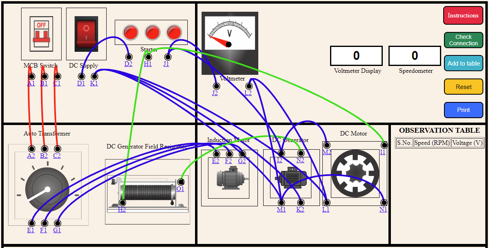

<b>STEP 1:</b> Make connections as per the instructions given below: 

<table>
<tr>
                <td style="border:1px solid black;"><b>From</b></td>
                <td style="border:1px solid black;">A1</td>
                <td style="border:1px solid black;">B1</td>
                <td style="border:1px solid black;">C1</td>
                <td style="border:1px solid black;">E1</td>
                <td style="border:1px solid black;">F1</td>
                <td style="border:1px solid black;">G1</td>
                <td style="border:1px solid black;">D1</td>
                <td style="border:1px solid black;">K1</td>
                <td style="border:1px solid black;">K1</td>
                <td style="border:1px solid black;">K1</td>
                <td style="border:1px solid black;">H1</td>
                <td style="border:1px solid black;">H1</td>
                <td style="border:1px solid black;">J1</td>
                <td style="border:1px solid black;">J1</td>
                <td style="border:1px solid black;">I2</td>
                <td style="border:1px solid black;">M1</td>
                <td style="border:1px solid black;">N2</td>
                <td style="border:1px solid black;">L1</td>
                <td style="border:1px solid black;">L2</td>
              
</tr>
<tr>
                <td style="border:1px solid black;"><b>To</b></td>
                <td style="border:1px solid black;">A2</td>
                <td style="border:1px solid black;">B2</td>
                <td style="border:1px solid black;">C2</td>
                <td style="border:1px solid black;">E2</td>
                <td style="border:1px solid black;">F2</td>
                <td style="border:1px solid black;">G2</td>
                <td style="border:1px solid black;">D2</td>
                <td style="border:1px solid black;">M1</td>
                <td style="border:1px solid black;">K2</td>
                <td style="border:1px solid black;">L1</td>
                <td style="border:1px solid black;">H2</td>
                <td style="border:1px solid black;">I1</td>
                <td style="border:1px solid black;">J2</td>
                <td style="border:1px solid black;">I2</td>
                <td style="border:1px solid black;">M2</td>
                <td style="border:1px solid black;">N1</td>
                <td style="border:1px solid black;">O1</td>
                <td style="border:1px solid black;">L2</td>
                <td style="border:1px solid black;">M1</td>
               
</tr>
</table>
                      
      

<b>STEP 2:</b> Click on <b>“Check Connection”</b> button to check the connections.  
<b>STEP 3:</b> If the connections are not correct, you can click on node number to detach the wire or click on <b>“Reset”</b> button to make all the connections again.  
<b>STEP 4:</b> If the connections are correct, then Turn “ON” the MCB Switch.  
<b>STEP 5:</b> Then, Click on the Auto Transformer knob.   
<b>STEP 6:</b> Now, Slide the Knob of the Rheostat. The readings of Voltmeter and RPM will be shown in the display.  
<b>STEP 7:</b> Click on <b>“Add to table”</b> button to add the readings to the observation table and Live Graph will be created when readings are added in the table.  
<b>STEP 8:</b> Click on <b>“Print”</b> button to print the webpage. 
