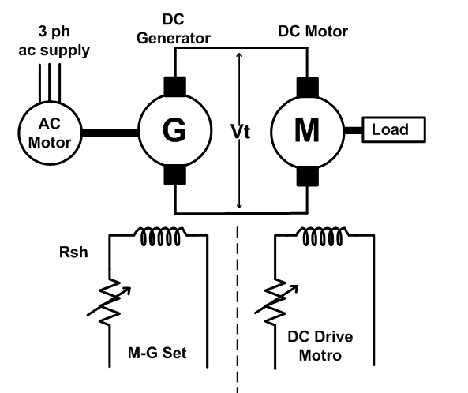
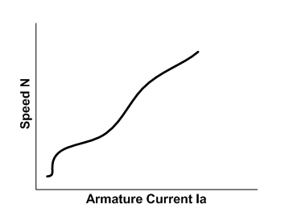

### Introduction 
In the ward-leonard method, the speed control of D.C. motor can be obtained by varying the applied voltage to the armature. In this method M is the main D.C. motor whose speed is to be controlled, and G is a separately excited D.C. generator which is driven by a 3-phase induction motor. The combination of ac driving motor and the dc generator is called the motor-generator set. 

### Speed control by varying armature resistance
The speed of a D.C. motor is directly proportional to the back e.m.f and inversely to the net flux per pole Ф,If brush contact drop is neglected i.e.,  

$$N = \frac {V-I_aR_a}{kФ}$$

Where, 
N = Speed in RPM 
V = Voltage applied across armature circuits 
Ra = armature resistance 
Ia = armature current 
K = constant  

Thus, the speed of a D.C motor may be varied by either of the following adjustments: 
1. Changing the flux per pole Ф, by varying the field current. 
2. Changing external resistance in the armature circuit. 
3. Changing the applied voltage V ( Ward-Leonard speed control method). 

### Ward-Leonard System:
This system is used where unusually wide and very sensitive speed control is required as for colliery winders, electric excavators, elevators and the main drives in steel mills and blooming and paper mills. M1 is the main motor whose speed control is required. The field of this motor is permanently connected across the dc supply lines. A dc or an ac motor M2 directly coupled to generator G. The motor M2 runs at an approximately constant speed. The output voltage of G is directly fed to the main motor M1.   
In this method the variable voltage to be applied to the motor armature is obtained from an additional separately excited d.c generator, and the motor under control is also run as a separately excited motor. The above equation shows that if the motor excitation is constant and the applied voltage V is varied the speed will be almost directly proportional to the armature voltage. 
The system can more be adapted for forward as well as reverse operation of the motor by changing the polarity of the voltage applied to its armature. This condition can be achieved by reversing the direction of the field current of the separately excited variable voltage generator. 
The variable voltage generator in Ward Leonard system is driven by a constant speed 3- phase induction motor. 

If the constant voltage d.c power for excitation is not available otherwise, the same may be obtained from a constant voltage exciter coupled with the auxiliary motor-generator set. The direction of the field current of the variable voltage generator may be reversed by anyone of the following two methods. 

1. By providing a reversing switch in the field circuit. 
2. By connecting two potentiometer rheostats across generator field across the movable terminals. 

### Circuit Diagram:

 

 Fig. 1: Equivalent circuit of ward leonard method
 

 
### Graph:

In the plotted graph speed is directly proportional to armature voltage. 

 

 Fig. 2: Armature voltage speed characteristics 
 

### Advantages of using Ward-Leonard method

1. It is a very smooth speed control system over a very wide range (from zero to normal speed of the motor). 
2. The speed can be controlled in both the direction of rotation of the motor easily. 
3. The motor can run with a uniform acceleration. 
4. Speed regulation of DC motor in this Ward Leonard system is very good. 
5. It has inherent regenerative braking property. 

### Drawbacks of Ward-Leonard method

1. Higher initial cost due to use of two additional machines of the same rating as the main dc motor. 
2. Larger size and weight. 
3. Requires more floor area and costly foundation. 
4. Frequent maintenance is needed. 
5. Lower efficiency due to higher losses. 
6. The drive produces more noise. 
